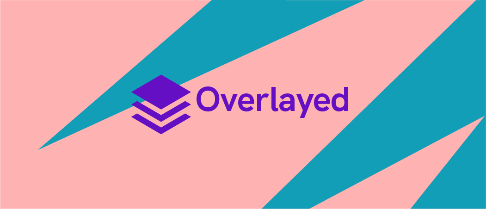

# Overlayed

Better stream overlays, For you and your viewers. 📺🔴

For more information, see [overlayed.app](https://overlayed.app). 💥

Overlayed is a platform for creating reactive broadcaster overlays using modern technology. The goal is to enable broadcasters to level-up their visual effects and increase engagement. To do this, we know we've got to have an approachable solution. Not just for the broadcaster, but for the developer. That's right - the visual effects **creation** is as much a priority as anything around here. Ready to learn more?

## For Developers

Hi there. You're the luckiest of the bunch at the moment - given that Overlayed is still not quite ready for primetime. We're looking for help with quite a few things, and we've definitely got some rough edges. To start contributing to the core project, see [CONTRIBUTING.md](./CONTRIBUTING.md). Soon we'll also have a guide for creating overlays - but it's not ready just yet. Thanks for understanding. 💙🌈

## For VFX Artists

Hello! We don't quite have the tooling for you in place just yet, I'm afraid - but we're working on it. Check back soon to see how you can get started. If you've got ideas, please [let us know](https://github.com/bengreenier/overlayed2/issues/new?assignees=&labels=enhancement&template=feature_request.md). Thanks for understanding. 💙🌈

## For Broadcasters

Hiya! You'll want to head over to [overlayed.app](https://overlayed.app) - that's the best place for you to get started with Overlayed. We'll help get things sorted so you can try the platform out as quickly as possible. Thanks! 💙🌈
